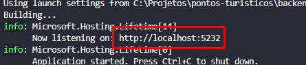

# Cadastro de Pontos Turísticos

Este projeto tem como objetivo implementar uma aplicação web para o cadastro e listagem de pontos turísticos de um país, com funcionalidades de cadastro, busca e listagem paginada.

## Objetivo do Teste

Avaliar a capacidade de evolução de uma solução para o problema proposto, levando em consideração as melhores práticas de desenvolvimento, organização do código e conhecimento nas tecnologias solicitadas.

## Requisitos do Teste

Tecnologias exigidas:
- **C# (CSharp)**
- **SQL** (SQLite ou SQL Server)
- **HTML/CSS**

## Funcionalidades

- **Cadastro de Pontos Turísticos**:
  - Nome, descrição (máximo de 100 caracteres), localização (endereço ou referência de localização), cidade e estado.
- **Listagem de Pontos Turísticos**:
  - Exibição paginada dos pontos turísticos cadastrados.
  - Ordenação dos pontos turísticos de forma decrescente pela data de inclusão.
  - Busca/filtragem por nome, descrição e localização.
- **Detalhamento de Ponto Turístico**:
  - Exibição de detalhes completos (nome, descrição e localização) ao clicar em um ponto turístico na listagem.

## Instruções para Execução

A execução do projeto pode ser realizada através do Microsoft Visual Studio Code

### 1. Clone o repositório:

```bash
git clone https://github.com/GabrielHosoume/pontos-turisticos.git
```

### 2. Configure do Banco de Dados SQL Server:
><b>IMPORTANTE!</b> <br> Possuir o Microsoft SQL Server instalado

##### Opção 1 (recomendada)
- Restaure o banco utilizando o backup `PontoTuristico.bak`, contido em `./database/PontoTuristico.bak`

##### Opção 2
- Importe arquivo de banco `PontoTuristico.bacpac`, contido no diretório `./databases/PontoTuristico.bacpac` via 'Import Data-tier Application' no Microsoft Sql Server Management Studio

##### Opção 3
- Execute o script `PontoTuristico.sql`, contido no diretório `./databases/PontoTuristico.sql`. 
> <b>IMPORTANTE!</b> <br>Caso opte pela opção 3, é necessário alterar o path de `FILENAME` de acordo com o diretório de seu Microsoft SQL Server.
```SQL
CREATE DATABASE [PontoTuristico]
 CONTAINMENT = NONE
 ON  PRIMARY 
( NAME = N'PontoTuristico', FILENAME = N'C:\Program Files\Microsoft SQL Server\MSSQL15.SQLEXPRESS\MSSQL\DATA\PontoTuristico.mdf' , SIZE = 8192KB , MAXSIZE = UNLIMITED, FILEGROWTH = 65536KB )
 LOG ON 
( NAME = N'PontoTuristico_log', FILENAME = N'C:\Program Files\Microsoft SQL Server\MSSQL15.SQLEXPRESS\MSSQL\DATA\PontoTuristico_log.ldf' , SIZE = 8192KB , MAXSIZE = 2048GB , FILEGROWTH = 65536KB )
 WITH CATALOG_COLLATION = DATABASE_DEFAULT
GO
```


### 3. Configurações do Backend:
><b>IMPORTANTE!</b><br>
> Versão do .NET recomendada: <b>9.0.101</b>

#### Passo 01:
- Após importado o banco, configure a string de conexão no arquivo `appsettings.json`, localizado em `./backend/PontosTuristicosAPI/PontosTuristicosAPI/appsettings.json`, substituindo o valor de `"PontoTuristicoCon"` com a conexão de seu banco. Exemplo:

```json
"ConnectionStrings": {
    "PontoTuristicoCon": "Data Source=DESKTOP-FPCBBHQ\\SQLEXPRESS;Initial Catalog=PontoTuristico;Integrated Security=true;TrustServerCertificate=True"
},
```

#### Passo 02:
- Executar no terminal do backend:
```shell
# Diretório da API
cd ./backend/PontosTuristicosAPI/PontosTuristicosAPI

# Executar a API
dotnet run
```

#### Passo 03:
- Copiar a URL/porta em que o backend estiver executando, exibido no terminal. Exemplo:



> OBSERVAÇÃO <br/>
> Endpoint para testar o funcionamento da API, exemplo:  http://localhost:5232/api/v1/pontosturisticos/ping

### 4. Configurações do Frontend
> <b>IMPORTANTE!</b> <br> Versão mínima do NodeJs: <b>14.x</b>.
> <br> Versão recomendada: <b>22.13.0</b>

#### Passo 01:
- Adequar a `config.js` (./frontend/pontos-turisticos/config.js), alterando a `apiUrl` com a URL em que o backend estiver rodando (item 03 do backend).
Exemplo:
```javascript
apiUrl: 'http://localhost:5232/api/v1',
```
> <b>IMPORTANTE!</b><br>
>  Utilizar o protocolo HTTPS e não HTTPS<br>
>  A URL deverá conter `/api/v1`, conforme no exemplo.<br> 
> >

#### Passo 02:
- Com os passos anteriores realizados (e backend em execução), executar a aplicação frontend:
```shell
# Diretório do frontend
cd ./frontend/pontos-turisticos

# Executar a aplicação
npm run dev
```

## Agradecimentos
Obrigado por dedicar seu tempo para analisar este projeto. Espero que ele demonstre minha paixão e capacidade por desenvolvimento.

Caso tenha dúvidas ou deseje discutir mais detalhes sobre este projeto, entre em contato comigo:

[](https://www.linkedin.com/in/gabriel-hosoume/) [](mailto:gabriel.hosoume@outlook.com)
 